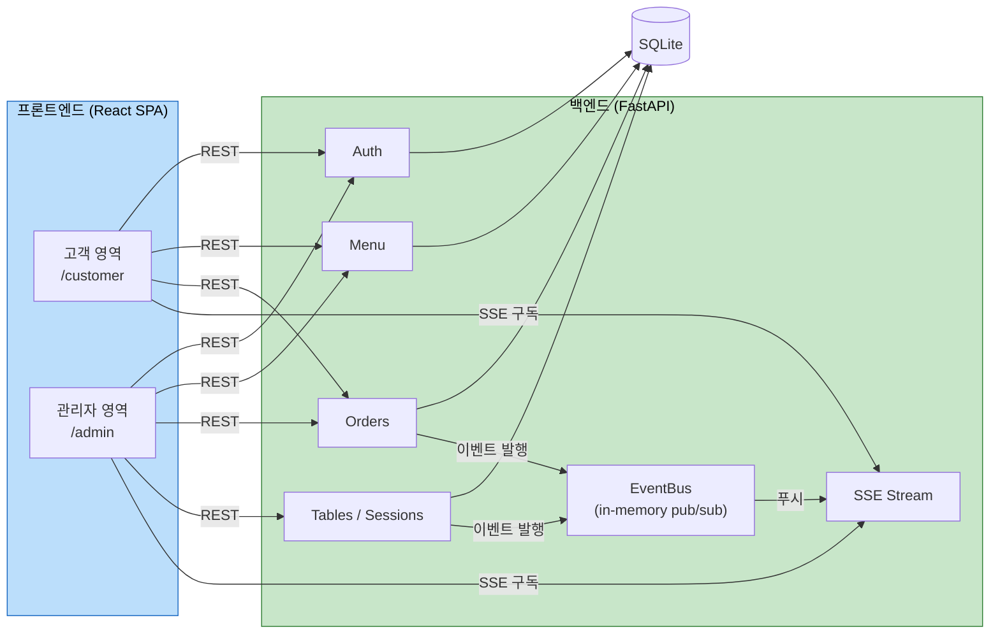

<div align="center">

# 🍽️ 테이블오더 (Table Order Service)

**매장 테이블에서 바로 주문하고, 매장은 실시간으로 관리하는 디지털 주문 시스템**

[](#-기술-스택)
[](#-기술-스택)
[](#-기술-스택)
[](#-주요-기능)
[](#-테스트)
[](#-라이선스)

고객은 별도 로그인 없이 테이블 태블릿으로 즉시 주문하고, 관리자는 들어오는 주문을 실시간 대시보드로 모니터링합니다.

</div>

---

## 📑 목차
- [소개](#-소개)
- [주요 기능](#-주요-기능)
- [화면 미리보기](#-화면-미리보기)
- [기술 스택](#-기술-스택)
- [아키텍처](#-아키텍처)
- [빠른 시작](#-빠른-시작)
- [데모 계정](#-데모-계정)
- [API 요약](#-api-요약)
- [테스트](#-테스트)
- [프로젝트 구조](#-프로젝트-구조)
- [개발 방법론 (AI-DLC)](#-개발-방법론-ai-dlc)
- [범위 외 기능](#-범위-외-기능)

---

## 📖 소개

테이블오더는 **단일 매장**을 위한 MVP 테이블오더 플랫폼입니다.

| 관점 | 제공 가치 |
|---|---|
| 🙋 **고객** | 대기 없는 즉시 주문, 직관적인 터치 UI, 실시간 주문 상태 확인 |
| 🧑‍🍳 **매장 운영자** | 실시간 주문 모니터링, 테이블 세션 관리, 손쉬운 메뉴 관리 |

> 결제·외부 연동·알림 등은 의도적으로 범위에서 제외한 학습/데모용 프로젝트입니다. ([범위 외 기능](#-범위-외-기능) 참고)

---

## ✨ 주요 기능

### 🙋 고객용 (Customer)
- **자동 로그인** — 테이블 태블릿 1회 설정 후 비밀번호 없이 자동 인증
- **메뉴 탐색** — 카테고리별 2열 카드 그리드, 카드에서 바로 수량 조절(➕ / ➖)
- **장바구니** — 로컬 저장(새로고침 유지), 실시간 총액 계산
- **주문하기** — 주문 확정 → 주문번호 표시 → 5초 후 메뉴 자동 복귀
- **주문 내역** — 현재 세션 주문을 **SSE 실시간**으로 상태 갱신(대기중/준비중/완료)

### 🧑‍🍳 관리자용 (Admin)
- **매장 인증** — JWT 기반 16시간 세션
- **실시간 모니터링** — 테이블별 그리드 대시보드, 신규 주문 **2초 이내** 강조 표시(SSE)
- **테이블 관리** — 태블릿 초기 설정, 주문 직권 삭제, 이용 완료(세션 종료), 과거 내역 조회
- **메뉴 관리** — 메뉴 등록/수정/삭제/노출 순서

---

## 🖼️ 화면 미리보기

> 태블릿(10인치) 세로 모드 기준, 따뜻한 식욕 자극 컬러톤(테라코타 + 앰버 + 크림).

| 고객 — 메뉴 | 고객 — 장바구니 | 고객 — 주문내역 | 관리자 — 대시보드 |
|:---:|:---:|:---:|:---:|
| 카테고리 탭 · 2열 카드 · 수량 뱃지 · 하단 요약바 | 수량 조절 · 소계 · 합계 · 주문하기 | 상태 뱃지(노랑/파랑/초록) · 실시간 갱신 | 테이블 카드 그리드 · 신규 강조 · 상태 변경 |

<sub>실행 후 `http://localhost:5173/customer`, `http://localhost:5173/admin/login` 에서 직접 확인하실 수 있습니다.</sub>

---

## 🛠 기술 스택

| 영역 | 기술 |
|---|---|
| **Backend** | Python 3.11 · FastAPI · SQLAlchemy 2 · Pydantic v2 · SSE(sse-starlette) |
| **Auth** | JWT(python-jose) · bcrypt(passlib) |
| **Database** | SQLite |
| **Frontend** | React 18 · Vite · React Router v6 · 순수 CSS |
| **Realtime** | Server-Sent Events (EventSource) |
| **Test** | pytest · Hypothesis(PBT) · Vitest · @testing-library/react |

---

## 🏗 아키텍처



**실시간 흐름**: 주문 생성/상태 변경 → `OrderRouter`가 `EventBus`에 발행 → `SSERouter`가 구독 중인 관리자·고객 클라이언트로 푸시 → 화면 자동 갱신.

---

## 🚀 빠른 시작

### 사전 요구 사항
- Python **3.11+**
- Node.js **18+** (권장 20+)

### 1) 백엔드 실행
```bash
cd backend
python3 -m venv .venv
source .venv/bin/activate          # Windows: .venv\Scripts\activate
pip install -r requirements.txt
python -m app.seed                 # 데모 데이터 생성
uvicorn app.main:app --port 8000
```
➡️ API 문서: http://localhost:8000/docs

### 2) 프론트엔드 실행 (새 터미널)
```bash
cd frontend
npm install
npm run dev
```
➡️ 고객: http://localhost:5173/customer · 관리자: http://localhost:5173/admin/login

> 백엔드 주소가 다르면 `VITE_API_BASE=http://host:port npm run dev` 로 지정하세요.

---

## 🔑 데모 계정

| 항목 | 값 |
|---|---|
| 매장 식별자 | `store001` |
| 관리자 | `admin` / `admin1234` |
| 테이블 | 1~6번 · 비밀번호 `table1234` |

**추천 체험 순서**
1. 관리자 로그인 → 대시보드 열어두기
2. 새 탭에서 고객 화면 접속 → 테이블 설정(store001 / 1 / table1234) 자동 로그인
3. 메뉴 담기 → 주문하기
4. 관리자 대시보드에 신규 주문이 **2초 내 강조** 표시 → 상태 변경 시 고객 주문내역 **실시간 갱신** 확인

---

## 🔌 API 요약

| 메서드 | 경로 | 설명 | 인증 |
|---|---|---|---|
| `POST` | `/api/auth/admin/login` | 관리자 로그인 | - |
| `POST` | `/api/auth/table/login` | 테이블 로그인 | - |
| `GET` | `/api/menu/categories` | 카테고리 조회 | 테이블 |
| `GET` | `/api/menu/items` | 메뉴 조회 | 테이블 |
| `POST/PUT/DELETE` | `/api/admin/menu/items` | 메뉴 관리 | 관리자 |
| `POST` | `/api/orders` | 주문 생성 | 테이블 |
| `GET` | `/api/orders/current` | 현재 세션 주문 조회 | 테이블 |
| `GET` | `/api/admin/orders` | 매장 전체 주문 조회 | 관리자 |
| `PATCH` | `/api/admin/orders/{id}/status` | 주문 상태 변경 | 관리자 |
| `DELETE` | `/api/admin/orders/{id}` | 주문 삭제 | 관리자 |
| `POST` | `/api/admin/tables/setup` | 테이블 초기 설정 | 관리자 |
| `GET` | `/api/admin/tables` | 테이블별 주문 집계 | 관리자 |
| `POST` | `/api/admin/tables/{id}/checkout` | 이용 완료(세션 종료) | 관리자 |
| `GET` | `/api/admin/tables/{id}/history` | 과거 내역 조회 | 관리자 |
| `GET` | `/api/admin/stream` · `/api/table/stream` | SSE 실시간 스트림 | 관리자/테이블 |

전체 명세는 실행 후 [Swagger UI](http://localhost:8000/docs)에서 확인하세요.

---

## 🧪 테스트

```bash
# 백엔드: 단위 + 속성 기반(PBT) + 통합  → 24 passing
cd backend && source .venv/bin/activate && python -m pytest -q

# 프론트엔드: 단위(장바구니 로직)        → 7 passing
cd frontend && npm test

# E2E 스모크 (백엔드 실행 + seed 후)     → 13 checks
cd backend && .venv/bin/python -m tests.e2e_smoke
```

| 구분 | 도구 | 개수 |
|---|---|---|
| 백엔드 단위/PBT/통합 | pytest + Hypothesis | 24 |
| 프론트엔드 단위 | Vitest | 7 |
| E2E 스모크 | HTTP/SSE 스크립트 | 13 |
| **합계** | | **44** |

> 속성 기반 테스트(PBT)는 총액 계산·주문번호·직렬화 round-trip·JWT 등 핵심 순수 로직의 불변식을 검증합니다.

---

## 📁 프로젝트 구조

```
table-order/
├── backend/                 # FastAPI + SQLite (UoW-1)
│   ├── app/
│   │   ├── core/            # DB·모델·보안·스키마·순수 로직
│   │   ├── auth/  menu/  orders/  tables/  realtime/
│   │   ├── main.py          # 앱 진입점 (라우터·CORS)
│   │   └── seed.py          # 데모 시드 데이터
│   └── tests/               # pytest + Hypothesis + e2e_smoke
│
├── frontend/                # React + Vite (UoW-2)
│   └── src/
│       ├── api/             # REST 클라이언트, SSE 훅
│       ├── store/           # localStorage (auth, cart)
│       ├── customer/        # 고객 화면 5종
│       └── admin/           # 관리자 화면 5종
│
├── aidlc-docs/              # 설계·계획·감사 문서 (AI-DLC 산출물)
└── requirements/            # 원본 요구사항 정의서
```

---

## 🤖 개발 방법론 (AI-DLC)

이 프로젝트는 **AI-DLC(AI-Driven Development Life Cycle)** 워크플로우로 설계·구현되었습니다.
요구사항 분석 → 사용자 스토리 → 애플리케이션 설계 → 유닛 분해 → 유닛별 설계/코드 생성 → 빌드·테스트의
전 과정이 단계별 승인과 함께 문서화되어 `aidlc-docs/`에 보존되어 있습니다.

- 요구사항/스토리: `aidlc-docs/inception/`
- 설계/코드 요약: `aidlc-docs/construction/`
- 전체 진행 상태·감사 로그: `aidlc-docs/aidlc-state.md`, `aidlc-docs/audit.md`

---

## 🚫 범위 외 기능

다음 기능은 의도적으로 구현하지 않았습니다 (`requirements/constraints.md`):

결제·PG 연동 · 영수증/환불 · 포인트/쿠폰 · SNS 로그인/2FA · 푸시/SMS/이메일 알림 ·
주방 디스플레이/재고 · 매출 리포트/분석 · 예약/리뷰 · 다국어 · 배달/POS 연동

---

## 📄 라이선스

MIT License. 자유롭게 학습·수정·배포하실 수 있습니다.

<div align="center"><sub>Built with FastAPI · React · ❤️ and the AI-DLC workflow</sub></div>
