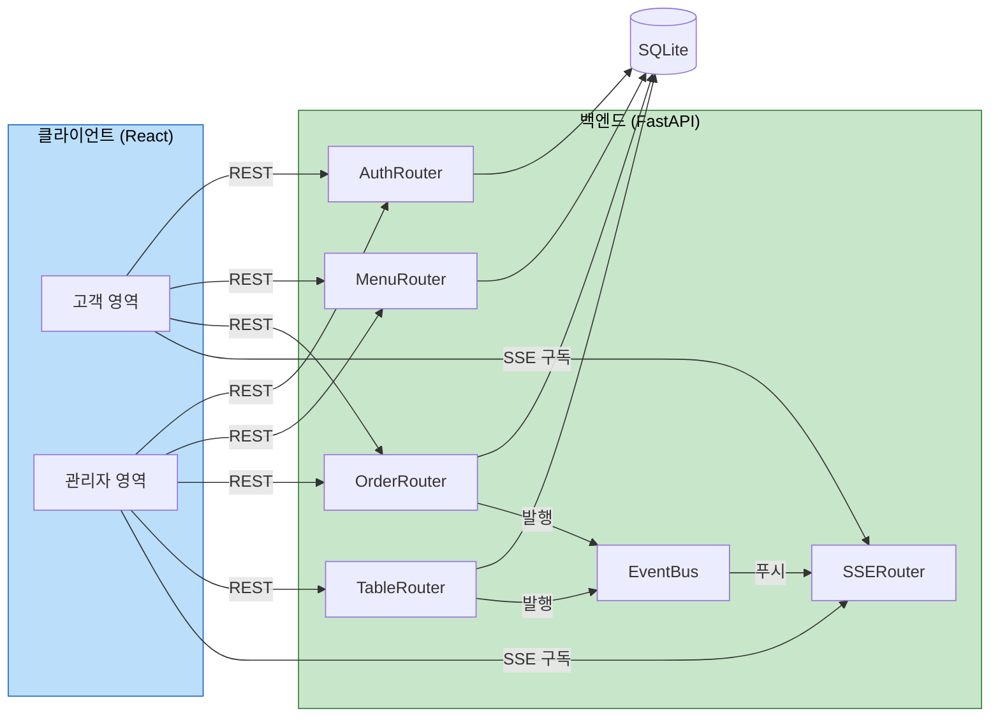

# 컴포넌트 의존성 및 통신 패턴 (Component Dependency)

## 의존성 매트릭스 (백엔드)

| 컴포넌트 → 의존 | Database | EventBus | Schemas | Auth(의존성) |
|---|---|---|---|---|
| AuthRouter (C-BE-1) | ✓ | - | ✓ | 발급/검증 |
| MenuRouter (C-BE-2) | ✓ | - | ✓ | 관리 시 admin |
| OrderRouter (C-BE-3) | ✓ | ✓ (발행) | ✓ | table/admin |
| TableRouter (C-BE-4) | ✓ | ✓ (발행) | ✓ | admin |
| SSERouter (C-BE-5) | - | ✓ (구독) | - | table/admin |
| EventBus (C-BE-6) | - | - | - | - |
| Seed (C-BE-9) | ✓ | - | - | - |

## 통신 패턴

- **클라이언트 ↔ 백엔드**: REST(JSON, Pydantic 검증) + SSE(text/event-stream)
- **백엔드 내부**: 라우터 핸들러 → DB 세션(SQLAlchemy), 라우터 → EventBus(인메모리 pub/sub)
- **실시간 전달**: OrderRouter/TableRouter가 변경 발생 시 EventBus에 발행 → SSERouter가 구독 중인 클라이언트로 푸시
- **인증**: FastAPI `Depends`로 JWT 검증 후 컨텍스트(store_id/table_id) 주입

## 프론트엔드 의존성

| 컴포넌트 → 의존 | ApiClient | SseClient | AuthStore | CartStore |
|---|---|---|---|---|
| 고객 화면들 (C-FE-2*) | ✓ | OrderHistory만 | ✓ | Cart 관련 |
| 관리자 화면들 (C-FE-3*) | ✓ | Dashboard만 | ✓ | - |

## 데이터 흐름 다이어그램

### 텍스트 대안
- 고객/관리자 React 영역은 REST로 Auth/Menu/Order(관리자는 Table 포함)를 호출하고, SSE로 SSERouter를 구독한다.
- 모든 라우터는 SQLite에 접근한다.
- OrderRouter와 TableRouter는 변경 발생 시 EventBus에 이벤트를 발행하고, EventBus는 SSERouter를 통해 구독 클라이언트로 푸시한다.

## 결합도 관찰
- EventBus는 인메모리 단일 프로세스 구조(로컬 실행 전제, Q6=A)로 단순화. 다중 인스턴스 확장은 범위 외.
- 단순 구조이나 EventBus를 경유한 발행/구독으로 라우터 간 직접 결합은 회피.
