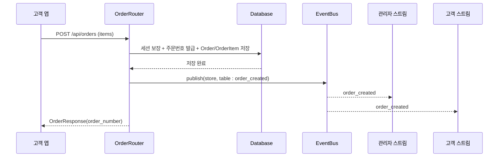

# 서비스 정의 및 오케스트레이션 (Services)

백엔드는 단순 구조(Q1=B)를 채택하므로, 별도의 두꺼운 서비스 계층 대신 **라우터 핸들러가 오케스트레이션을 담당**하고, 재사용 로직은 **얇은 헬퍼 함수/모듈**로 분리합니다. 아래는 논리적 서비스 단위(오케스트레이션 흐름)를 정의합니다.

---

## S-1: 인증 서비스 흐름 (Auth)
- **책임**: 자격 증명 검증, 토큰 발급/검증
- **오케스트레이션**:
  1. 관리자 로그인: store_code 조회 → AdminUser 조회 → bcrypt 검증 → JWT 발급(exp=16h)
  2. 테이블 로그인: store_code + table_number 조회 → table_password bcrypt 검증 → 테이블 토큰 발급
  3. 보호된 요청: 토큰 디코드 → 컨텍스트 주입(Depends)
- **협력 컴포넌트**: AuthRouter, Database, Schemas

## S-2: 메뉴 서비스 흐름 (Menu)
- **책임**: 메뉴/카테고리 조회 및 관리
- **오케스트레이션**:
  - 조회(공개): 카테고리/메뉴 SELECT(노출 순서 정렬)
  - 관리(인증): 검증 → INSERT/UPDATE/DELETE → 순서 재정렬
- **협력 컴포넌트**: MenuRouter, Database, Schemas

## S-3: 주문 서비스 흐름 (Order)
- **책임**: 주문 생성/조회/상태변경/삭제 및 실시간 이벤트 발행
- **오케스트레이션 (주문 생성)**:
  1. 테이블 컨텍스트 확인 → 활성 세션 보장(`_ensure_active_session`, 첫 주문이면 세션 시작)
  2. 주문번호 발급(`_next_order_number`, 일자별 순번)
  3. 총액 계산(`_calc_total`) → Order/OrderItem INSERT (메뉴명·단가 스냅샷)
  4. `EventBus.publish("store:{store_id}", order_created)` 및 `table:{table_id}` 발행
  5. OrderResponse 반환(주문번호 포함)
- **오케스트레이션 (상태 변경/삭제)**:
  - 상태 변경 → UPDATE → `order_status_changed` 발행(store + table)
  - 삭제 → DELETE → 총액 재계산 → `order_deleted` 발행
- **협력 컴포넌트**: OrderRouter, TableRouter(세션 헬퍼), EventBus, Database

## S-4: 테이블/세션 서비스 흐름 (Table & Session)
- **책임**: 테이블 설정 및 세션 라이프사이클
- **오케스트레이션 (이용 완료)**:
  1. 확인 → 활성 세션의 모든 Order를 OrderHistory로 이동(`_archive_session`)
  2. 완료 시각 기록 → 세션 상태 closed, 종료 시각 기록
  3. 테이블 현재 주문/총액 0 리셋(주문 이동으로 자연 리셋)
  4. `EventBus.publish("store:{store_id}", session_closed)` 및 `table:{table_id}` 발행
- **오케스트레이션 (과거 내역)**: OrderHistory SELECT(날짜 필터, 시간 역순)
- **협력 컴포넌트**: TableRouter, OrderRouter, EventBus, Database

## S-5: 실시간 전달 서비스 흐름 (Realtime/SSE)
- **책임**: 이벤트 구독자에게 실시간 전달
- **오케스트레이션**:
  1. 클라이언트가 SSE 엔드포인트 연결 → 토픽 구독(`EventBus.subscribe`)
  2. 발행된 이벤트를 async generator로 스트리밍(text/event-stream)
  3. 연결 종료 시 구독 해제
- **협력 컴포넌트**: SSERouter, EventBus

---

## 오케스트레이션 다이어그램 (주문 생성 → 실시간 반영)

### 텍스트 대안
1. 고객 앱이 주문 생성 요청
2. OrderRouter가 세션 보장, 주문번호 발급, DB 저장
3. EventBus에 order_created 이벤트 발행(store/table 토픽)
4. 관리자 스트림과 고객 스트림으로 이벤트 전달
5. OrderRouter가 주문번호 포함 응답 반환
