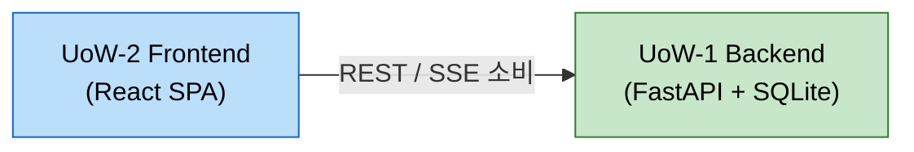

# 유닛 의존성 매트릭스 (Unit of Work Dependency)

## 의존성 매트릭스

| 유닛 | 의존 대상 | 의존 유형 | 비고 |
|---|---|---|---|
| UoW-1 Backend | (없음) | - | 기반 유닛, 외부 의존 없음 (SQLite는 내장) |
| UoW-2 Frontend | UoW-1 Backend | 런타임 (REST/SSE API 소비) | 빌드 타임 의존은 없음(API 계약만 필요) |

## 의존성 그래프



### 텍스트 대안
- UoW-2 Frontend는 런타임에 UoW-1 Backend의 REST/SSE API를 소비한다.
- UoW-1 Backend는 다른 유닛에 의존하지 않는 기반 유닛이다.

## 구현 순서 (의존성 기반 위상 정렬, Q3=A)

1. **UoW-1 Backend** (기반 유닛) — API 계약 및 데이터 모델 확정
2. **UoW-2 Frontend** (Backend API 계약에 의존)

> 백엔드 유닛을 먼저 완성하면 API 계약(엔드포인트/스키마)이 고정되어 프론트엔드 구현이 안정적으로 진행됩니다.

## 백엔드 유닛 내부 모듈 의존성 (참고)

```
core (DB/모델/인증) ← auth, menu, orders, tables, realtime
orders → tables(세션 헬퍼), realtime(이벤트 발행)
tables → realtime(이벤트 발행)
realtime(SSE) ← auth(토큰 검증)
```

- `core`는 모든 모듈의 기반.
- `orders`는 세션 보장을 위해 `tables`의 세션 헬퍼를, 실시간 발행을 위해 `realtime`을 사용.
- 순환 의존은 없음(헬퍼는 함수 수준으로 분리).
