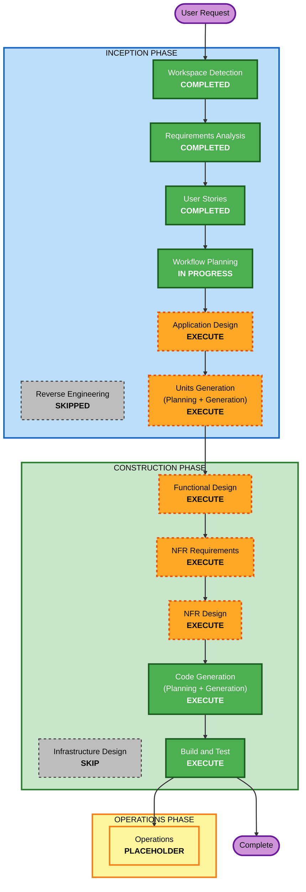

# 실행 계획 (Execution Plan)

## 상세 분석 요약 (Detailed Analysis Summary)

### 변경 영향 평가 (Change Impact Assessment)
- **User-facing changes**: Yes — 고객용 주문 UI와 관리자용 운영 UI 신규 개발
- **Structural changes**: Yes — 백엔드(FastAPI) + 2개 프론트엔드(React) + SQLite의 신규 시스템 아키텍처 구축
- **Data model changes**: Yes — Store, AdminUser, Table, TableSession, Category, MenuItem, Order, OrderItem, OrderHistory 등 신규 스키마
- **API changes**: Yes — 인증, 메뉴, 주문, 테이블/세션 관리, SSE 스트림 등 신규 API 다수
- **NFR impact**: Yes — 실시간성(SSE 2초 이내), 인증/세션(JWT 16시간, bcrypt), 테스트 품질(PBT Partial)

### 리스크 평가 (Risk Assessment)
- **Risk Level**: Medium — 신규 그린필드로 운영 시스템 영향은 없으나, 실시간(SSE) + 세션 라이프사이클 + 다중 컴포넌트로 인한 통합 복잡도 존재
- **Rollback Complexity**: Easy — 로컬 그린필드, 운영 데이터/시스템 의존 없음
- **Testing Complexity**: Moderate — 비즈니스 로직(세션 리셋, 총액 계산) 및 실시간 흐름 검증 필요

## 워크플로우 시각화 (Workflow Visualization)



### 텍스트 대안 (Text Alternative)
```
INCEPTION PHASE
- Workspace Detection: COMPLETED
- Reverse Engineering: SKIPPED (그린필드)
- Requirements Analysis: COMPLETED
- User Stories: COMPLETED
- Workflow Planning: IN PROGRESS
- Application Design: EXECUTE
- Units Generation: EXECUTE

CONSTRUCTION PHASE (유닛별 반복)
- Functional Design: EXECUTE
- NFR Requirements: EXECUTE
- NFR Design: EXECUTE
- Infrastructure Design: SKIP (로컬 실행, 인프라 변경 없음)
- Code Generation: EXECUTE (항상)
- Build and Test: EXECUTE (항상)

OPERATIONS PHASE
- Operations: PLACEHOLDER
```

## 실행할 단계 (Phases to Execute)

### INCEPTION PHASE
- [x] Workspace Detection (COMPLETED)
- [x] Reverse Engineering (SKIPPED — 그린필드, 기존 코드 없음)
- [x] Requirements Analysis (COMPLETED)
- [x] User Stories (COMPLETED)
- [x] Execution Plan (IN PROGRESS)
- [ ] Application Design — **EXECUTE**
  - **Rationale**: 신규 컴포넌트(백엔드 서비스, 2개 프론트엔드)와 컴포넌트 메서드/비즈니스 규칙, 서비스 계층 설계가 필요함
- [ ] Units Generation — **EXECUTE**
  - **Rationale**: 신규 데이터 모델, 다수의 API 엔드포인트, 복잡한 비즈니스 로직(세션 라이프사이클), 상태 관리 변경으로 구조적 분해 필요

### CONSTRUCTION PHASE (유닛별 반복)
- [ ] Functional Design — **EXECUTE**
  - **Rationale**: 신규 데이터 모델/스키마와 복잡한 비즈니스 로직(세션 리셋, 총액 재계산, 주문 상태 전이) 상세 설계 필요. PBT-01 속성 식별도 이 단계에서 수행
- [ ] NFR Requirements — **EXECUTE**
  - **Rationale**: 성능(SSE 2초), 보안(JWT/bcrypt), 테스트 품질(PBT 프레임워크 선정 PBT-09) 등 NFR 및 기술 스택 확정 필요
- [ ] NFR Design — **EXECUTE**
  - **Rationale**: SSE 실시간 패턴, 인증/세션 패턴 등 NFR 설계 반영 필요
- [ ] Infrastructure Design — **SKIP**
  - **Rationale**: 로컬 개발 환경 단일 머신 실행(Q6=A). 클라우드/인프라 리소스 매핑 불필요. 실행 방법은 Build and Test 단계의 빌드/실행 지침으로 충분히 커버
- [ ] Code Generation — **EXECUTE (ALWAYS)**
  - **Rationale**: 구현 계획 수립 및 코드 생성 필요
- [ ] Build and Test — **EXECUTE (ALWAYS)**
  - **Rationale**: 빌드, 테스트(PBT 포함), 검증 및 로컬 실행 지침 필요

### OPERATIONS PHASE
- [ ] Operations — PLACEHOLDER
  - **Rationale**: 향후 배포/모니터링 워크플로우용 (현재 범위 외)

## 성공 기준 (Success Criteria)
- **Primary Goal**: 단일 매장 테이블오더 MVP의 동작하는 구현 (고객용/관리자용 UI + FastAPI 백엔드 + SQLite)
- **Key Deliverables**:
  - 고객용 React 앱 (메뉴/장바구니/주문/주문내역)
  - 관리자용 React 앱 (인증/실시간 모니터링/테이블 관리/메뉴 관리)
  - FastAPI 백엔드 (REST API + SSE) + SQLite 스키마 + 시드 스크립트
  - 단위/통합 테스트 및 PBT(Partial) 테스트
- **Quality Gates**:
  - 전체 사용자 스토리 수용 기준 충족
  - 신규 주문 2초 이내 실시간 반영
  - 세션 종료 시 현재 주문 리셋 및 과거 이력 이동 정상 동작
  - PBT 적용 규칙(PBT-02, 03, 07, 08, 09) 준수

## 예상 단계 수 (Estimated)
- **Total Stages to Execute (remaining)**: Application Design, Units Generation, (유닛별) Functional Design / NFR Requirements / NFR Design / Code Generation, Build and Test
- **Stages Skipped**: Reverse Engineering, Infrastructure Design
